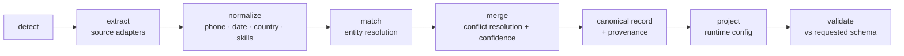

# Multi-Source Candidate Data Transformer

Fuse messy candidate data from many sources into **one clean, canonical profile**
per candidate — normalized, deduplicated, with **per-field provenance** (where each
value came from) and an **explainable confidence** score. On top of the fixed
canonical schema, a runtime **config reshapes the output with no code changes**.

> Guiding principle, enforced throughout: **wrong-but-confident is worse than
> honestly-empty.** Unknown values become `null`; they are never invented.

---

## Why this is interesting (highlights)

- **Explainable confidence model** — `confidence = source_reliability × method_weight`,
  boosted by cross-source agreement and capped below `1.0`. Every decision is printed
  in a human-readable **audit trail** (`--explain`).
- **Trust-ladder conflict resolution** — a value backed by several independent sources
  can out-rank a single higher-trust source; losers are kept in the audit trail.
- **Real projection engine** — a mini path language (`emails[0]`, `skills[].name`,
  `experience[0].title`) powers the configurable output, and the result is
  **validated against the requested schema**.
- **Robust by construction** — a garbage/malformed source is caught at a boundary,
  reported in a per-source **health report**, and never crashes the run.
- **Deterministic** — stable ordering and no wall-clock/randomness, verified by an
  `output_sha256` and a determinism test.
- **Plugin adapters** — each source is one small file implementing a common interface.

---

## Pipeline



The canonical record (internal) and the projection (external) are kept strictly
separate — that separation is what makes the configurable output possible.

---

## Sources implemented

| Group | Source | Adapter | Notes |
|------|--------|---------|-------|
| Structured | Recruiter CSV | `recruiter_csv` | `name,email,phone,current_company,title` |
| Structured | ATS JSON | `ats_json` | **foreign field names** mapped to canonical |
| Unstructured | GitHub | `github_api` | live REST API **+ offline cache fallback** |
| Unstructured | Resume | `resume` | **PDF / DOCX / TXT**, section-aware parser |
| Unstructured | Recruiter notes | `recruiter_notes` | free text, conservative extraction |

---

## Quickstart

```powershell
# 1. Create a virtual environment and install
python -m venv .venv
.\.venv\Scripts\Activate.ps1            # Windows PowerShell
#  source .venv/bin/activate            # macOS/Linux
pip install -e ".[dev]"

# 2. Default canonical output (full schema, with provenance + confidence)
transform run --inputs data/samples --github janedoe

# 3. Configurable output (the example config from the brief) + see the reasoning
transform run --inputs data/samples --github janedoe \
  --config config/example_config.json --explain --hash

# 4. A second, different projection — same engine, no code changes
transform run --inputs data/samples --github janedoe \
  --config config/custom_config_recruiter.json
```

`transform` is the installed console script; `python -m transformer.cli run ...`
works identically. Canonical/projected JSON goes to **stdout**; the health report,
audit trail, validation result and hash go to **stderr** (so stdout stays pipeable).

### Web UI (live config editing)

```powershell
uvicorn webui.app:app --reload
# open http://127.0.0.1:8000
```

Edit the projection config in the browser and hit **Project** to see the reshaped
output, confidence/provenance, validation status, and the source-health panel update
live. Inputs are the bundled samples + cached GitHub (deterministic, offline).

### CLI options

| Flag | Meaning |
|------|---------|
| `-i, --inputs` | input file or directory (non-recursive) |
| `-c, --config` | projection config JSON (omit for full canonical) |
| `-g, --github` | GitHub login or profile URL to ingest |
| `--live-github` | fetch GitHub live (default: offline cache) |
| `-o, --out` | write output JSON to a file |
| `-r, --report` | write the per-source health report JSON |
| `--explain` | print the per-field decision/audit trail |
| `--hash` | print the deterministic `output_sha256` |

---

## Canonical schema

```
candidate_id        string
full_name           string | null
emails              string[]
phones              string[]            # E.164
location            { city, region, country }   # country = ISO-3166 alpha-2
links               { linkedin, github, portfolio, other[] }
headline            string | null
years_experience    number | null
skills              [{ name, confidence, sources[] }]   # canonical names
experience          [{ company, title, start, end, summary }]   # dates YYYY-MM
education            [{ institution, degree, field, end_year }]
provenance          [{ field, source, method }]
overall_confidence  number
```

## Configurable output (the twist)

A config can select a subset of fields, rename/remap via a `from` path, set per-field
normalization, toggle provenance/confidence, and choose a missing-value policy
(`null` / `omit` / `error`).

```jsonc
{
  "fields": [
    { "path": "full_name", "type": "string", "required": true },
    { "path": "primary_email", "from": "emails[0]", "type": "string", "required": true },
    { "path": "phone", "from": "phones[0]", "type": "string", "normalize": "E164" },
    { "path": "skills", "from": "skills[].name", "type": "string[]", "normalize": "canonical" }
  ],
  "include_confidence": true,
  "on_missing": "null"
}
```

The projected output is then **validated** against these declared `type`/`required`
flags before it is returned.

---

## How merge + confidence work

1. **Match** records into one candidate via strong, identifying keys (email, phone,
   github, linkedin) using union-find. We deliberately do **not** merge on name+company
   alone — two different people named "John Smith" at "Acme" must not be fused. Matching
   is conservative: a wrong merge is exactly the "wrong-but-confident" failure we avoid.
2. For each field, group the competing values and score each group as
   `base_confidence(best supporter) boosted by how many sources agree`. The highest
   score wins; ties break deterministically. Multi-value fields (emails, phones,
   skills) are unioned and de-duplicated.
3. **Confidence**: `reliability × method_weight`, `+8%` per extra agreeing source,
   capped at `0.99`. `overall_confidence` is the mean of populated-field confidences.

Source reliability (trust ladder): `ats_json 0.90`, `recruiter_csv 0.85`,
`github_api 0.80`, `resume 0.70`, `recruiter_notes 0.55`.

---

## Edge cases handled

- **Conflicting current role** (CSV/resume say *Senior* @ *Acme Corp*; ATS says
  *Staff* @ *Acme Corporation*) → agreement + company-name normalization pick the
  cleaner, multiply-attested value; the conflict is logged.
- **Garbage source** (`garbage_source.json` is invalid JSON) → caught, flagged in the
  health report, run continues.
- **Phone without country code** → normalized with a region hint (US default; ATS
  country for international); unparseable numbers are dropped, never coerced.
- **Skill aliases / typos** (`JS`, `ReactJS`, `k8s`, `Postgres`, `golang`) →
  canonicalized via dictionary + fuzzy match; unknown skills are kept verbatim at
  lower confidence (not invented, not dropped).
- **Dates** (`Mar 2021`, `Present`, `2021-02-15`) → `YYYY-MM`; ongoing → `end = null`;
  a year-only token will not fabricate a month.
- **Multiple emails across sources** → unioned and de-duplicated.

## Deliberately descoped

ML-based entity resolution (deterministic heuristics instead); live LinkedIn scraping
(blocked in practice); full PDF layout/table parsing (text-extractable resumes);
a database/persistence layer (file in, JSON out).

---

## Tests

```powershell
pytest -q
```

Covers normalizers, the projection path language + validation, conflict resolution
(including the agreement-beats-trust edge case), an end-to-end **golden profile**,
**determinism**, and **robustness** (garbage source does not crash and is flagged).

## Project structure

```
src/transformer/
  models.py            canonical + internal extraction models
  config_models.py     OutputConfig / FieldSpec
  sources/             adapters: recruiter_csv, ats_json, github_api, resume, recruiter_notes
  normalize/           phone, date, country, skills, name, links
  matching.py          entity resolution (union-find)
  merge.py             conflict resolution + confidence + audit trail
  confidence.py        the confidence model
  projection.py        path language + config projection
  validation.py        validate projected output vs requested schema
  pipeline.py          orchestration + determinism hash
  cli.py               command-line surface
webui/                 FastAPI app with live config editing
config/                default schema + example + custom configs
data/samples/          synthetic, overlapping, conflicting inputs (+ garbage source)
data/output/           the output produced on the sample inputs
tests/                 unit + golden + robustness
```

## Sample data & outputs

`data/samples/` contains two overlapping candidates (Jane Doe across all five
sources with deliberate conflicts; John Smith with a UK phone) plus an intentionally
malformed source. Pre-generated results live in `data/output/`. Binary resume
fixtures (`.docx`/`.pdf`) can be regenerated with
`python scripts/generate_samples.py`.

## Demo video

> ~2 min walkthrough: https://drive.google.com/file/d/1ISXyGQax2aMDnxiwzC-gmqZV6F-CGq1W/view?usp=drivesdk

## Assumptions

- Recruiter-CSV phones default to the **US** region when no country code is present.
- GitHub is read from the offline cache by default for reproducibility; `--live-github`
  hits the real API and refreshes the cache.
